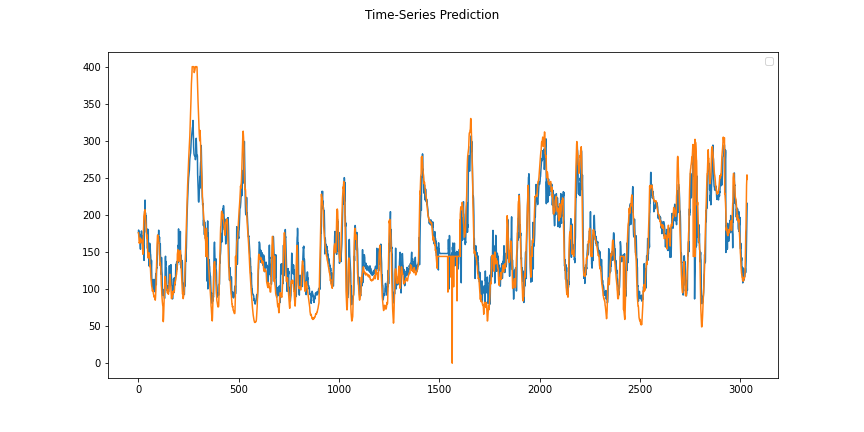

# Blood Glucose (BG) Timeseries Forecasting with Deep Neural Networks and Deep Reinforcement Learning
description of the given code....

## Dataset: Ohio Dataset
In the Ohio data, we provide you with 8 features that could be used to predict future blood glucoe values. The data is extracted from the xml files to which the Ohio-publication refers.
5minute_intervals_timestamp: it is a standardized to timestamps.
Features:
- missing_cbg: an indicater if the cbg measure is missing for a certain timestamp
- cbg: blood glucose measurement
- finger: finger-stick blood glucose measurement for reference
- basal: basal insuline delivery rate
- bolus: bolus insuline doses for meal correction etc
- hr: heartrate
- gsr: galvanic skin response
- carbInput: self-reported carbohydrate input

### Data Preprocessing 

### Evaluation Metrics
For the evaluation we used the metrics of RMSE (Root Mean Square Error), MARD (Mean Absolute Relative Difference) and CC (Correlation Coefficient).

## Requirements for LSTM with Keras
- Tensorflow version 2.9.0
- Keras-Applications version 1.0.8
- Keras-Preprocessing version 1.1.2

## Requirements for Deep Reinforcement Learning
```
pip install tensorflow==1.14.0
pip install stable-baselines
pip install stable-baselines[mpi]
pip install mpi4py
```
## Example of usage
**Time-series prediction for LSTM or bi-LSTM Model:** Read data, train and save the model, make predicts and display the results or save it in csv file.
```
python main_lstm.py
```
Arguments:<br />
--data_type : Choose between **new** (OhioData2020) or **old** (OhioData2018).<br />
--model_name : Choose between **lstm** or **bilsmt** architectures.<br />
--ph : Prediction Horizons, choose between **6** (30 min) or **12** (60 min)<br />
--save_path: Path to save the models and plots<br />

## Results (e.g. Bi-LSTM)
1. Timeseries prediction



3. Evaluation Metrics


